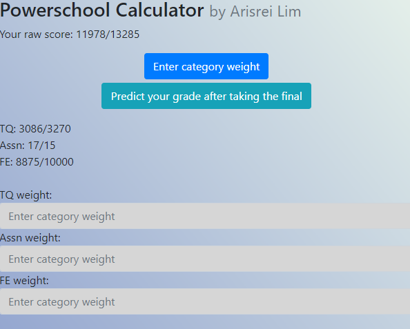

# Powerschool-Calculator
Chrome extension that utilizes jquery, bootstrap, and javascript to calculate your current grade, raw score, and predict what your grade will be after taking the final.

Popup.js is run first, which then injects payload.js into the page. Since popup.js cannot directly communicate with the webpage, it uses payload.js to parse all information needed and then send that information to popup.js. This information is then displayed on popup.html, which is the html file of the chrome extension.
